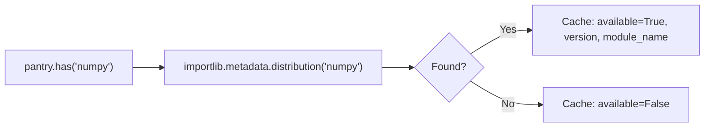

# Architecture

## Overview

Pantry is a thin wrapper over `importlib.metadata`. Two files, ~300 lines total.

```text
src/pantry/
├── __init__.py       # Module-as-instance bootstrap (25 lines)
├── _registry.py      # The entire API (303 lines)
└── py.typed          # PEP 561 marker
```

## On-Demand Probing

Unlike earlier versions, Pantry does **not** scan `pyproject.toml` or probe
packages at startup. Everything happens on demand:



- `has()` — metadata check only, no import
- `get()` / `[]` — triggers `importlib.import_module()` on first access, then cached

This means `import pantry` is essentially free — no filesystem scanning,
no module imports. Work happens only when you ask.

## Module Name Resolution

When a distribution is found, Pantry resolves the importable module name:

1. **`top_level.txt`** from distribution metadata (`pillow` → `PIL`)
2. **Top-level `__init__.py`** in distribution files
3. **Top-level `.py` files** (non-private)
4. **Fallback**: replace hyphens with underscores

## Module-as-Instance Pattern

`__init__.py` replaces the module with a `Pantry` instance:

```python
_instance = Pantry()
sys.modules[__name__] = _instance
```

This is a well-known Python idiom. After this, `import pantry` returns
the instance directly, enabling `pantry.has("x")`, `pantry["x"]`, etc.

## Lazy Import Subsystem

A separate registry (`self._lazy`) for deferred imports of own modules.
Exists to break circular imports. Resolution uses two steps:

1. `importlib.import_module(path)` — for modules and submodules
2. `importlib.import_module(parent)` + `getattr` — for classes and functions

Completely independent from the external dependency cache (`self._cache`).

## simulate_missing

Uses a `self._hidden` set. When a package name is in `_hidden`, `has()`,
`get()`, `[]`, decorator, and `report()` all treat it as unavailable.
The probe cache is untouched — removing from `_hidden` instantly restores
availability.

## Design Decisions

**No pyproject.toml dependency.** Earlier versions required `pyproject.toml`
to be present at runtime. This broke in installed contexts (Docker, pip install).
Now Pantry uses only `importlib.metadata`, which works everywhere.

**No dependency groups.** Groups (`has_group`) were removed because they
required pyproject.toml. Pantry checks any installed package directly.

**Zero external dependencies.** Everything uses Python standard library.
`packaging` was removed as a dependency.

**On-demand, not eager.** No work at import time. Probing and importing
happen when you call `has()`, `get()`, or `[]`.
