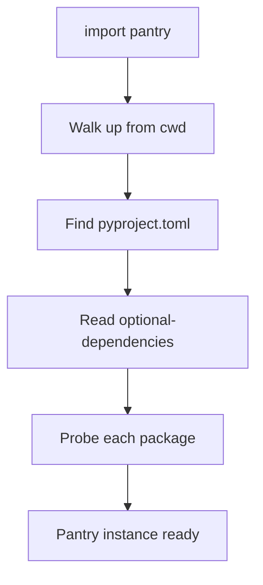

# Getting Started

## Installation

```bash
pip install mypantry
```

The only runtime dependency is [`packaging`](https://pypi.org/project/packaging/).

For development (tests, linting, type checking):

```bash
pip install mypantry[dev]
```

## Setup

Pantry reads your `pyproject.toml` automatically. No extra configuration files,
no plugin registration, no setup code.

Declare optional dependencies in your `pyproject.toml` as you normally would:

```toml
[project]
name = "my-awesome-lib"

[project.optional-dependencies]
imaging = ["pillow>=10.0", "wand"]
data = ["numpy>=1.24", "pandas>=2.0"]
cache = ["redis>=5.0"]
```

That's it. Pantry will find this file and probe every package listed.

## First Use

```python
import pantry

# Check what's available
print(pantry.report())
```

Output:

```text
pantry report
──────────────────────────────────────────────────────
group     package  module  version  ok
imaging   pillow   PIL     10.4.0   ✓
imaging   wand     wand    -        ✗
data      numpy    numpy   1.26.4   ✓
data      pandas   pandas  2.1.4    ✓
cache     redis    redis   -        ✗
──────────────────────────────────────────────────────
available: 3/5
```

The `repr` gives a quick summary too:

```python
>>> import pantry
>>> pantry
Pantry(3/5 available)
```

## How Discovery Works

When you `import pantry`, the module:

1. **Walks up** from the current working directory looking for `pyproject.toml`
2. **Reads** `[project.optional-dependencies]` from it
3. **Probes** each listed package (is it installed? is it importable? what version?)
4. **Replaces** the module object with a `Pantry` instance

This means `import pantry` gives you an object you can use directly —
no factory calls needed for the common case.



### What if there's no pyproject.toml?

If no `pyproject.toml` is found (e.g. in a REPL session), Pantry creates
an empty instance. `import pantry` never fails — `has()` will return `False`
for everything, and `report()` will show "(no optional dependencies declared)".

## Explicit Construction

If you need to target a specific `pyproject.toml` or control the discovery path:

```python
from pantry import Pantry

# From a specific file
p = Pantry.from_pyproject("path/to/pyproject.toml")

# Walk upward from a given directory
p = Pantry.discover(start="/my/project")
```

This is useful for:

- **Testing** — point to a fixture `pyproject.toml`
- **Multi-project setups** — probe dependencies for a specific project
- **CLI tools** — discover from a user-provided path

## Next Steps

- {doc}`usage` — all access patterns in detail
- {doc}`api` — full API reference
